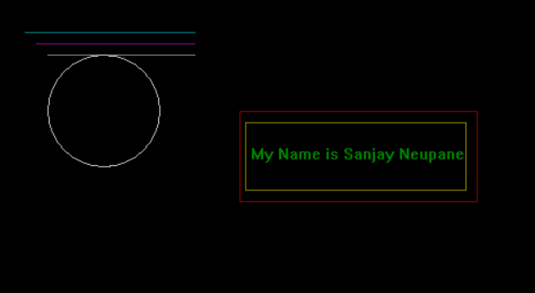

# INTRODUCTION TO COMPUTER GRAPHICS AND BASIC DRAWING USING C  
# OUTPUT 
  
# CONCLUSION 
In the lab, we do the basic of drawing of drawing line,cirlce, rectangle and to write our name using graphics.h.
