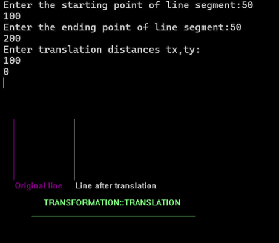
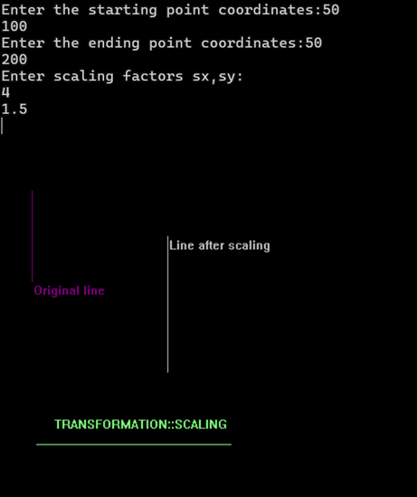
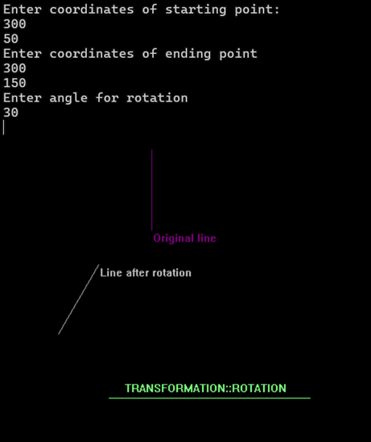

## 2D TRANSFORMATION

# TRANSLATION
# Formula
    Consider (x,y) are old coordinates of a point. Then the new coordinates of that same point (x’,y’) can be obtained as follows: 
    X’=x+tx 
    Y’=y+ty

#OUTPUT

# Scaling
# Formula
    If (x, y) are old coordinates of object, then new coordinates of object after applying scaling 
    transformation are obtained as: 
    x’=x*sx 
    y’=y*sy. 
    sx and sy are scaling factors along x-axis and y-axis.

# OUTPUT

# ROTATION
# FORMULA
   If (x, y) are old coordinates of object, then new coordinates of object after applying rotation 
    transformation are obtained as: 
    x’ = xcosθ -ysinθ 
    y’ = xsinθ+ ycosθ 

# OUTPUT

# REFLECTION
# X-axis reflection
# FORMULA
       If (x, y) are old coordinates of object, then new coordinates of object after applying X-axis reflection are:
       x'=x;
       y'=-y;

# OUTPUT

# Y-axis reflection
# FORMULA
     If (x, y) are old coordinates of object, then new coordinates of object after applying X-axis reflection are:
     x'=-x;
     y'=y;

# OUTPUT

# CONCLUSION
In these lab, We successfully demostrated the concept of the transformation.
